# EMLY — AI-Powered Mental Health Companion

<p align="center">
  <strong>An AI-powered mobile companion designed to provide accessible, personalized, and responsible mental health support.</strong>
</p>

<p align="center">
  Flutter • Artificial Intelligence • Conversational AI • CBT • Voice Interaction
</p>

---

## 📌 Overview

EMLY is an AI-powered mental health companion mobile application developed as a Final Year Project at the National Textile University, Faisalabad.

The application combines conversational AI, voice interaction, mental health screening, Cognitive Behavioral Therapy (CBT)-based activities, mood tracking, reports, and healthcare support features into a single mobile platform.

EMLY is designed to provide users with an accessible and supportive environment where they can communicate with an AI companion, complete structured mental health activities, monitor their progress, and access relevant healthcare resources.

> **Important:** EMLY is designed for educational support, self-reflection, and mental health screening. It does not replace professional medical care and is not intended to provide medical diagnosis.

---

## ✨ Key Highlights

- 🤖 AI-powered conversational mental health companion
- 💬 Text-based mental health conversations
- 🎙️ Voice-based interaction
- 🧠 Structured mental health screening
- 📝 Individual mental health reports
- 🌱 CBT-based activities and plans
- 😊 Mood check-ins and tracking
- 📊 Progress and activity monitoring
- 👨‍⚕️ Doctor discovery and healthcare support
- 📚 Conversation history
- 🔔 Local notifications and reminders
- 🔐 Secure authentication and session management
- 🌙 Light and dark theme support
- 📱 Responsive Flutter mobile interface

---

# 📱 App Screenshots

The following screenshots showcase the major screens and workflows of the EMLY mobile application, presented in both **Light** and **Dark** themes.

### 🚀 Splash & Welcome

<p align="center">
  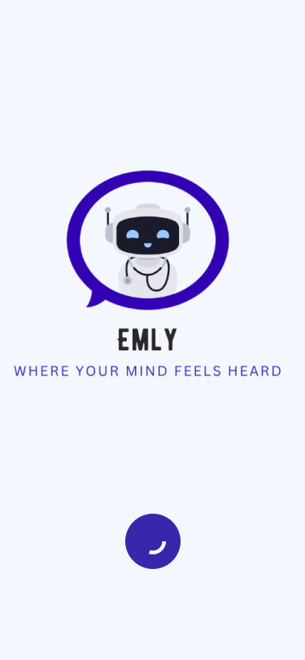
  &nbsp;&nbsp;&nbsp;
  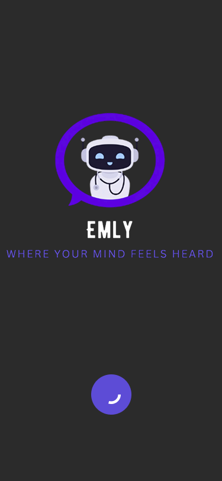
</p>

<p align="center">
  <em>Light Theme &nbsp;&nbsp;&nbsp;&nbsp;&nbsp;&nbsp;&nbsp; Dark Theme</em>
</p>

<p align="center">
  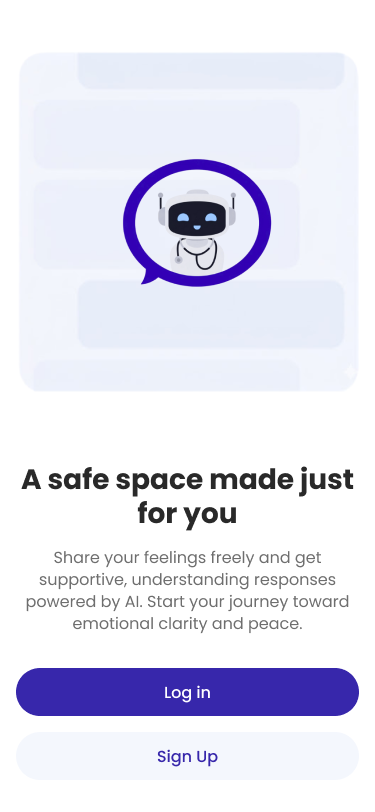
  &nbsp;&nbsp;&nbsp;
  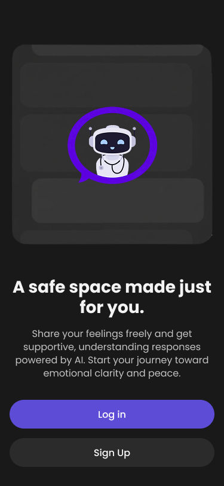
</p>

<p align="center">
  <em>Light Theme &nbsp;&nbsp;&nbsp;&nbsp;&nbsp;&nbsp;&nbsp; Dark Theme</em>
</p>

---

### 🏠 Home

<p align="center">
  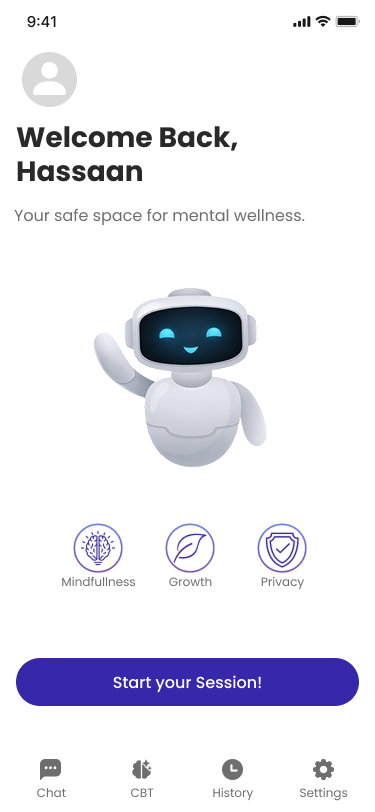
  &nbsp;&nbsp;&nbsp;
  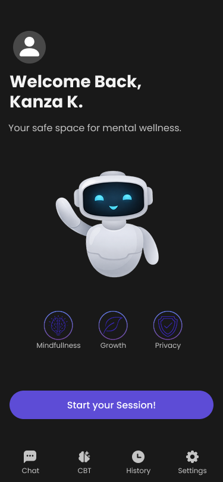
</p>

<p align="center">
  <em>Light Theme &nbsp;&nbsp;&nbsp;&nbsp;&nbsp;&nbsp;&nbsp; Dark Theme</em>
</p>

---

### 💬 Chat Interaction

<p align="center">
  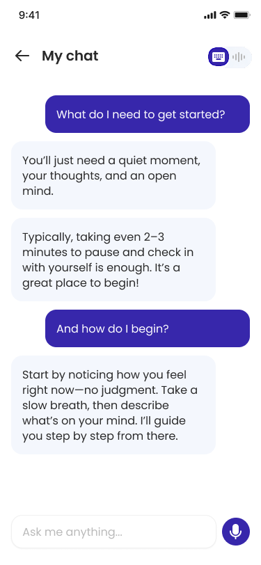
  &nbsp;&nbsp;&nbsp;
  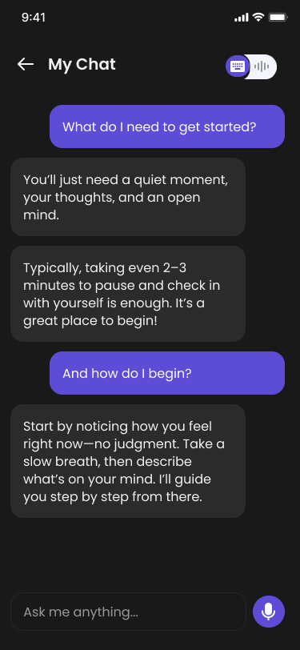
</p>

<p align="center">
  <em>Light Theme &nbsp;&nbsp;&nbsp;&nbsp;&nbsp;&nbsp;&nbsp; Dark Theme</em>
</p>

### 🎙️ Voice Chat

<p align="center">
  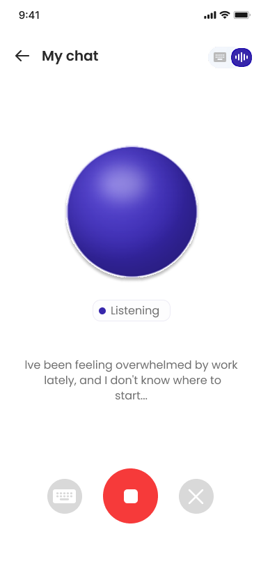
  &nbsp;&nbsp;&nbsp;
  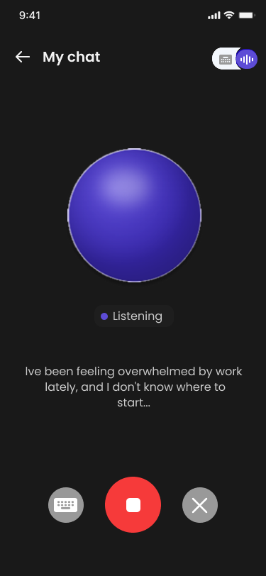
</p>

<p align="center">
  <em>Light Theme &nbsp;&nbsp;&nbsp;&nbsp;&nbsp;&nbsp;&nbsp; Dark Theme</em>
</p>

---

### 🧠 CBT Plan

<p align="center">
  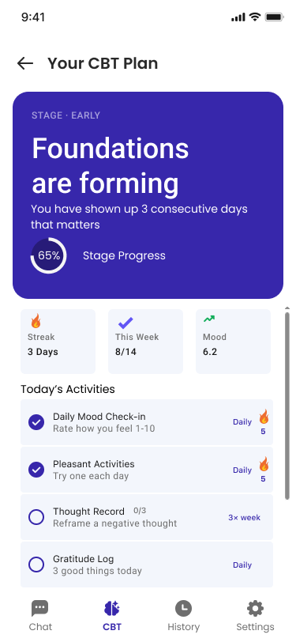
  &nbsp;&nbsp;&nbsp;
  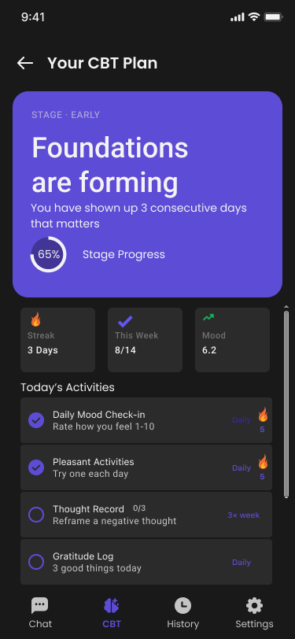
</p>

<p align="center">
  <em>Light Theme &nbsp;&nbsp;&nbsp;&nbsp;&nbsp;&nbsp;&nbsp; Dark Theme</em>
</p>

### 😊 Mood Check-in

<p align="center">
  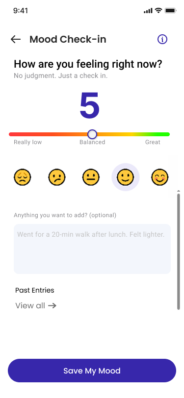
  &nbsp;&nbsp;&nbsp;
  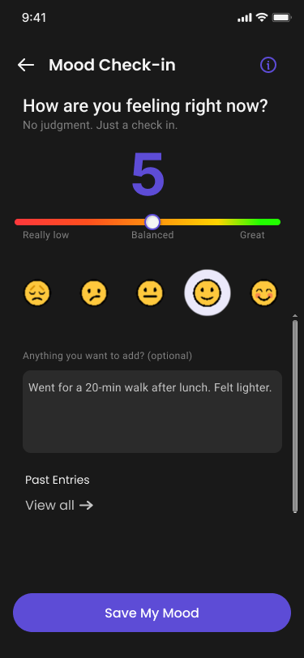
</p>

<p align="center">
  <em>Light Theme &nbsp;&nbsp;&nbsp;&nbsp;&nbsp;&nbsp;&nbsp; Dark Theme</em>
</p>

---

### 📊 Individual Mental Health Report

<p align="center">
  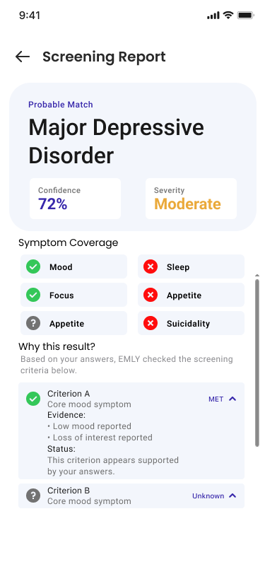
  &nbsp;&nbsp;&nbsp;
  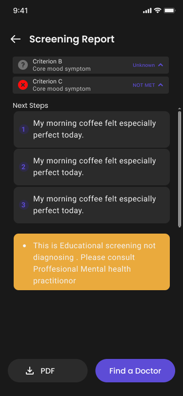
</p>

<p align="center">
  <em>Light Theme &nbsp;&nbsp;&nbsp;&nbsp;&nbsp;&nbsp;&nbsp; Dark Theme</em>
</p>

---

### 👨‍⚕️ Find a Doctor

<p align="center">
  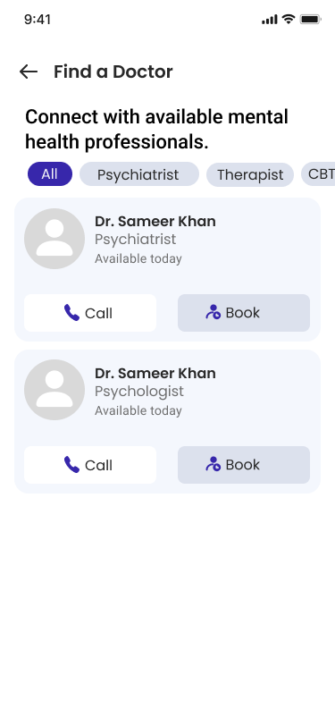
  &nbsp;&nbsp;&nbsp;
  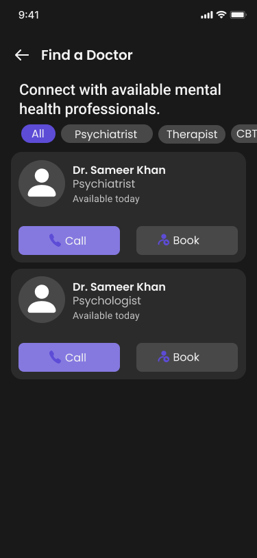
</p>

<p align="center">
  <em>Light Theme &nbsp;&nbsp;&nbsp;&nbsp;&nbsp;&nbsp;&nbsp; Dark Theme</em>
</p>

---

### 📚 History

<p align="center">
  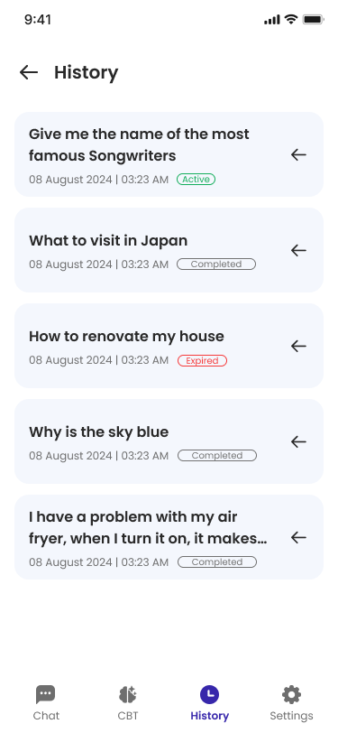
  &nbsp;&nbsp;&nbsp;
  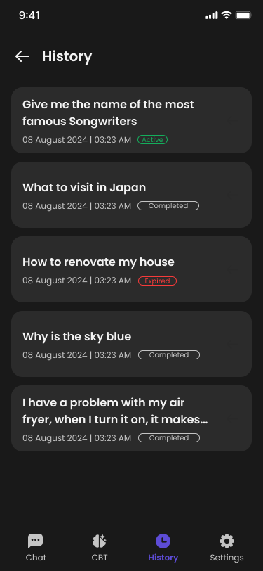
</p>

<p align="center">
  <em>Light Theme &nbsp;&nbsp;&nbsp;&nbsp;&nbsp;&nbsp;&nbsp; Dark Theme</em>
</p>

### ⚙️ Settings

<p align="center">
  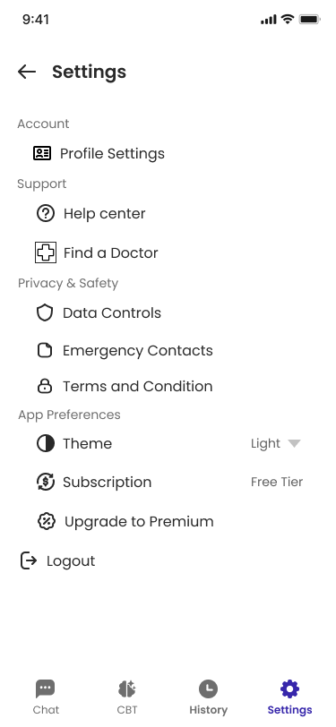
  &nbsp;&nbsp;&nbsp;
  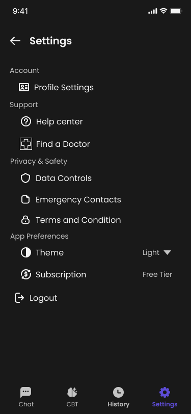
</p>

<p align="center">
  <em>Light Theme &nbsp;&nbsp;&nbsp;&nbsp;&nbsp;&nbsp;&nbsp; Dark Theme</em>
</p>

---

# 🧩 Core Features

## 🤖 AI Mental Health Companion

EMLY provides a conversational AI interface where users can interact with the system through text and voice.

The conversational experience is designed around supportive interaction while keeping mental health screening and assessment workflows structured and controlled.

---

## 💬 Text Chat

Users can communicate with EMLY through a real-time text-based conversation interface.

The chat experience supports:

- Conversational interaction
- Session-based conversations
- Conversation history
- Structured mental health workflows
- Context-aware responses
- Session reports

---

## 🎙️ Voice Interaction

EMLY supports voice-based interaction for a more natural conversational experience.

The voice pipeline integrates speech-to-text and text-to-speech services to allow users to communicate through spoken input and receive spoken responses.

---

## 🧠 Mental Health Screening

The application includes a structured screening workflow designed around standardized mental health assessment concepts.

The system separates:

- Conversation and user interaction
- Information extraction
- Assessment logic
- Screening decisions
- Response generation

This separation helps keep the assessment workflow controlled rather than allowing a generative AI model to independently determine screening outcomes.

---

## 🌱 CBT-Based Activities

EMLY provides structured Cognitive Behavioral Therapy (CBT)-inspired activities to encourage self-reflection and healthy behavioral patterns.

Activities include areas such as:

- Mood tracking
- Pleasant activities
- Thought records
- Identifying thinking traps
- Sleep tracking
- Gratitude
- Self-compassion
- Weekly reflection
- Progress monitoring

---

## 😊 Mood Check-in

Users can record their mood and reflect on their emotional state.

Mood information can be used to help users monitor their personal progress over time.

---

## 📊 Reports

EMLY provides individual reports based on completed screening and interaction workflows.

Reports are designed to present structured information in a clear and user-friendly format.

---

## 👨‍⚕️ Healthcare Support

The application includes healthcare-oriented features such as:

- Doctor discovery
- Doctor information
- Appointment-related functionality
- Emergency contact support

These features are intended to help connect users with appropriate human support when needed.

---

## 📚 Conversation History

Users can access their previous conversation sessions and review their interaction history.

---

## 🔐 Authentication & Security

The application uses authenticated sessions with secure token handling.

Authentication functionality includes:

- User registration
- User login
- Token-based authentication
- Access token and refresh token handling
- Session management
- Google authentication integration
- Secure local token storage

---

# 🛠️ Technology Stack

### Frontend

- **Flutter**
- **Dart**
- Material/Cupertino UI components
- Responsive mobile UI

### AI & Voice

- **OpenAI API**
- Speech-to-Text
- **Azure Speech Services**
- Text-to-Speech

### Backend

- **FastAPI**
- REST APIs
- JWT-based authentication

### Local Storage & Security

- SharedPreferences
- Flutter Secure Storage

### Important Flutter Packages

- `dio`
- `flutter_secure_storage`
- `google_sign_in`
- `record`
- `permission_handler`
- `audioplayers`
- `shared_preferences`
- `image_picker`
- `url_launcher`
- `pdf`
- `printing`
- `open_filex`
- `flutter_local_notifications`
- `timezone`
- `flutter_timezone`
- `shimmer`

---

# 🔗 Backend Integration

The Flutter application communicates with the EMLY backend through REST APIs.

Backend API:

```text
https://fyp-mental-health-therapist-fastapi.onrender.com